# System Architecture Analysis

## Overview

- **Project**: /home/tom/github/wronai/code2logic
- **Primary Language**: python
- **Languages**: python: 123, shell: 5, javascript: 1
- **Analysis Mode**: static
- **Total Functions**: 1371
- **Total Classes**: 187
- **Modules**: 129
- **Entry Points**: 1181

## Architecture by Module

### code2logic.parsers
- **Functions**: 79
- **Classes**: 3
- **File**: `parsers.py`

### examples.run_examples
- **Functions**: 65
- **File**: `run_examples.sh`

### fixed_advanced_data_analyzer
- **Functions**: 61
- **Classes**: 1
- **File**: `fixed_advanced_data_analyzer.py`

### final_advanced_data_analyzer
- **Functions**: 61
- **Classes**: 1
- **File**: `final_advanced_data_analyzer.py`

### advanced_data_analyzer
- **Functions**: 61
- **Classes**: 1
- **File**: `advanced_data_analyzer.py`

### ultimate_advanced_data_analyzer
- **Functions**: 61
- **Classes**: 1
- **File**: `ultimate_advanced_data_analyzer.py`

### code2logic.generators
- **Functions**: 60
- **Classes**: 5
- **File**: `generators.py`

### code2logic.terminal
- **Functions**: 52
- **Classes**: 2
- **File**: `terminal.py`

### flow
- **Functions**: 51
- **Classes**: 9
- **File**: `flow.py`

### lolm.rotation
- **Functions**: 37
- **Classes**: 6
- **File**: `rotation.py`

### code2logic.universal
- **Functions**: 31
- **Classes**: 8
- **File**: `universal.py`

### code2logic.gherkin
- **Functions**: 29
- **Classes**: 6
- **File**: `gherkin.py`

### code2logic.cli
- **Functions**: 27
- **Classes**: 2
- **File**: `cli.py`

### code2logic.reproducer
- **Functions**: 25
- **Classes**: 5
- **File**: `reproducer.py`

### code2logic.llm_profiler
- **Functions**: 23
- **Classes**: 4
- **File**: `llm_profiler.py`

### lolm.manager
- **Functions**: 22
- **Classes**: 2
- **File**: `manager.py`

### code2logic.toon_format
- **Functions**: 21
- **Classes**: 2
- **File**: `toon_format.py`

### lolm.clients
- **Functions**: 20
- **Classes**: 6
- **File**: `clients.py`

### llm_refactoring_executor
- **Functions**: 18
- **Classes**: 1
- **File**: `llm_refactoring_executor.py`

### code2logic.intent
- **Functions**: 18
- **Classes**: 4
- **File**: `intent.py`

## Key Entry Points

Main execution flows into the system:

### code2logic.cli.main
- **Calls**: time.time, argparse.ArgumentParser, parser.add_argument, parser.add_argument, parser.add_argument, parser.add_argument, parser.add_argument, parser.add_argument

### code2logic.cli._code2logic_llm_cli
- **Calls**: argparse.ArgumentParser, parser.add_subparsers, sub.add_parser, sub.add_parser, p_config.add_subparsers, config_sub.add_parser, sub.add_parser, p_set_provider.add_argument

### code2logic.parsers.UniversalParser._parse_js_ts
> Parse JS/TS using regex patterns.
- **Calls**: re.finditer, re.finditer, re.finditer, re.finditer, re.finditer, re.finditer, re.finditer, re.finditer

### examples.benchmark_report.main
- **Calls**: None.resolve, examples.benchmark_report._load_json, examples.benchmark_report._load_json, examples.benchmark_report._load_json, examples.benchmark_report._load_json, examples.benchmark_report._load_json, examples.benchmark_report._load_json, None.strftime

### scripts.configure_llm.main
> Main entry point.
- **Calls**: pipeline_runner_utils_improved.ConsolidatedMarkdownWrapper.print, pipeline_runner_utils_improved.ConsolidatedMarkdownWrapper.print, pipeline_runner_utils_improved.ConsolidatedMarkdownWrapper.print, pipeline_runner_utils_improved.ConsolidatedMarkdownWrapper.print, pipeline_runner_utils_improved.ConsolidatedMarkdownWrapper.print, pipeline_runner_utils_improved.ConsolidatedMarkdownWrapper.print, pipeline_runner_utils_improved.ConsolidatedMarkdownWrapper.print, scripts.configure_llm.check_ollama

### code2logic.universal.UniversalParser._parse_js_ts
> Parse JavaScript/TypeScript file.
- **Calls**: CodeLogic, content.split, enumerate, line.strip, stripped.startswith, re.match, re.match, str

### code2logic.parsers.UniversalParser._parse_rust
> Parse Rust using regex patterns.
- **Calls**: re.finditer, re.finditer, re.finditer, re.finditer, re.finditer, re.finditer, re.compile, fn_pat.finditer

### code2logic.universal.UniversalParser._parse_python
> Parse Python file.
- **Calls**: CodeLogic, content.split, enumerate, line.strip, stripped.startswith, stripped.startswith, str, stripped.startswith

### code2logic.generators.MarkdownGenerator.generate
> Generate Markdown output.

Args:
    project: ProjectInfo analysis results
    detail_level: 'compact', 'standard', or 'detailed'

Returns:
    Markdo
- **Calls**: lines.append, lines.append, lines.append, lines.append, lines.append, lines.append, lines.append, lines.append

### code2logic.function_logic.FunctionLogicGenerator.generate_toon
> Generate function-logic in TOON format.

Args:
    context: Structural context level:
        'none'    - flat function list (original behavior)
     
- **Calls**: TOONGenerator, list, lines.append, lines.append, lines.append, getattr, lines.append, lines.append

### examples.benchmark_summary.main
- **Calls**: pipeline_runner_utils_improved.ConsolidatedMarkdownWrapper.print, pipeline_runner_utils_improved.ConsolidatedMarkdownWrapper.print, pipeline_runner_utils_improved.ConsolidatedMarkdownWrapper.print, files.items, pipeline_runner_utils_improved.ConsolidatedMarkdownWrapper.print, os.path.join, os.path.exists, set

### code2logic.generators.YAMLGenerator.generate_hybrid
> Generate hybrid format combining TOON compactness with YAML completeness.

Features:
- Compact module overview (like TOON header)
- Full YAML structur
- **Calls**: code2logic.generators.bytes_to_kb, yaml.dump, getattr, code2logic.generators.bytes_to_kb, modules_overview.append, code2logic.generators.bytes_to_kb, self._extract_dataclasses, self._extract_conditional_imports

### logic2code.cli.main
> Main CLI entry point.
- **Calls**: argparse.ArgumentParser, parser.add_argument, parser.add_argument, parser.add_argument, parser.add_argument, parser.add_argument, parser.add_argument, parser.add_argument

### code2logic.parsers.UniversalParser._parse_java
> Parse Java using regex patterns.
- **Calls**: re.finditer, re.finditer, re.finditer, re.finditer, re.finditer, re.finditer, re.finditer, content.split

### code2logic.benchmarks.runner.BenchmarkRunner.run_project_benchmark
> Run benchmark on entire project.

Args:
    project_path: Path to project
    formats: Formats to test
    limit: Max files to process
    verbose: Pr
- **Calls**: self._should_use_llm, BenchmarkResult, generated_code.analyzer.analyze_project, len, time.time, result.calculate_aggregates, pipeline_runner_utils_improved.ConsolidatedMarkdownWrapper.print, pipeline_runner_utils_improved.ConsolidatedMarkdownWrapper.print

### code2logic.analyzer.ProjectAnalyzer._scan_files
> Scan and parse all source files.
- **Calls**: time.time, self._get_git_nonignored_files, os.walk, log.info, log.info, fp.suffix.lower, self.LANGUAGE_EXTENSIONS.get, len

### code2logic.parsers.TreeSitterParser._parse_js_ts
> Parse JavaScript/TypeScript source using Tree-sitter AST.
- **Calls**: set, self._walk_nested_functions, content.split, ModuleInfo, functions.append, seen_fn_names.add, list, len

### code2logic.benchmarks.runner.BenchmarkRunner._template_generate_code
> Generate minimal code without an LLM (fallback mode).
- **Calls**: classes.extend, classes.extend, functions.extend, functions.extend, functions.extend, functions.extend, re.findall, classes.extend

### fixed_advanced_data_analyzer.FixedHybridDataAnalyzer.analyze_inter_module_dependencies
> Analyze inter-module dependencies and suggest centralization.
- **Calls**: self._load_all_functions, nx.DiGraph, defaultdict, all_functions.items, nx.betweenness_centrality, module_graph.nodes, isinstance, len

### final_advanced_data_analyzer.FinalAdvancedDataAnalyzer.analyze_inter_module_dependencies
> Analyze inter-module dependencies and suggest centralization.
- **Calls**: self._load_all_functions, nx.DiGraph, defaultdict, all_functions.items, nx.betweenness_centrality, module_graph.nodes, isinstance, len

### advanced_data_analyzer.HybridDataAnalyzer.analyze_inter_module_dependencies
> Analyze inter-module dependencies and suggest centralization.
- **Calls**: self._load_all_functions, nx.DiGraph, defaultdict, all_functions.items, nx.betweenness_centrality, module_graph.nodes, isinstance, len

### ultimate_advanced_data_analyzer.UltimateAdvancedDataAnalyzer.analyze_inter_module_dependencies
> Analyze inter-module dependencies and suggest centralization.
- **Calls**: self._load_all_functions, nx.DiGraph, defaultdict, all_functions.items, nx.betweenness_centrality, module_graph.nodes, isinstance, len

### code2logic.parsers.UniversalParser._extract_ast_class
> Extract class from Python AST node.
- **Calls**: any, ClassInfo, isinstance, isinstance, isinstance, bases.append, isinstance, methods.append

### code2logic.toon_format.TOONGenerator._generate_modules
> Generate modules section.
- **Calls**: lines.append, self._quote, round, lines.append, lines.append, lines.append, self._compress_module_path, lines.append

### code2logic.parsers.TreeSitterParser._parse_python
> Parse Python source using Tree-sitter AST.
- **Calls**: content.split, len, self._extract_type_checking_imports, self._extract_aliases, ModuleInfo, content.encode, enhanced_constants.extend, self._extract_py_constant

### code2logic.parsers.UniversalParser._parse_csharp
> Parse C# using regex patterns.
- **Calls**: re.finditer, re.finditer, re.finditer, re.finditer, re.finditer, re.finditer, content.split, ModuleInfo

### examples.behavioral_benchmark.main
- **Calls**: Path, Path, Path, out_dir.mkdir, json.loads, examples.behavioral_benchmark._load_module_from_path, len, sum

### examples.05_llm_integration.main
- **Calls**: argparse.ArgumentParser, parser.add_argument, parser.add_argument, parser.add_argument, parser.add_argument, parser.add_argument, parser.parse_args, pipeline_runner_utils_improved.ConsolidatedMarkdownWrapper.print

### flow.ReverseEngineeringGenerator.generate_llm_prompt
> Generate comprehensive LLM prompt for system understanding.
- **Calls**: prompt.append, prompt.append, prompt.append, prompt.append, prompt.append, prompt.append, self.analyzer.call_graph.items, prompt.append

### lolm.cli.main
> Main CLI entry point.
- **Calls**: argparse.ArgumentParser, parser.add_subparsers, subparsers.add_parser, status_parser.set_defaults, subparsers.add_parser, set_provider_parser.add_argument, set_provider_parser.set_defaults, subparsers.add_parser

## Process Flows

Key execution flows identified:

### Flow 1: main
```
main [code2logic.cli]
```

### Flow 2: _code2logic_llm_cli
```
_code2logic_llm_cli [code2logic.cli]
```

### Flow 3: _parse_js_ts
```
_parse_js_ts [code2logic.parsers.UniversalParser]
```

### Flow 4: _parse_rust
```
_parse_rust [code2logic.parsers.UniversalParser]
```

### Flow 5: _parse_python
```
_parse_python [code2logic.universal.UniversalParser]
```

### Flow 6: generate
```
generate [code2logic.generators.MarkdownGenerator]
```

### Flow 7: generate_toon
```
generate_toon [code2logic.function_logic.FunctionLogicGenerator]
```

### Flow 8: generate_hybrid
```
generate_hybrid [code2logic.generators.YAMLGenerator]
  └─ →> bytes_to_kb
  └─ →> bytes_to_kb
```

### Flow 9: _parse_java
```
_parse_java [code2logic.parsers.UniversalParser]
```

### Flow 10: run_project_benchmark
```
run_project_benchmark [code2logic.benchmarks.runner.BenchmarkRunner]
  └─ →> analyze_project
```

## Key Classes

### fixed_advanced_data_analyzer.FixedHybridDataAnalyzer
> Fixed analyzer for hybrid export data.
- **Methods**: 60
- **Key Methods**: fixed_advanced_data_analyzer.FixedHybridDataAnalyzer.__init__, fixed_advanced_data_analyzer.FixedHybridDataAnalyzer.run_all_analyses, fixed_advanced_data_analyzer.FixedHybridDataAnalyzer.analyze_data_hubs_and_consolidation, fixed_advanced_data_analyzer.FixedHybridDataAnalyzer.extract_redundant_processes, fixed_advanced_data_analyzer.FixedHybridDataAnalyzer.cluster_data_types_for_unification, fixed_advanced_data_analyzer.FixedHybridDataAnalyzer.detect_data_flow_cycles, fixed_advanced_data_analyzer.FixedHybridDataAnalyzer.identify_unused_data_structures, fixed_advanced_data_analyzer.FixedHybridDataAnalyzer.quantify_process_diversity, fixed_advanced_data_analyzer.FixedHybridDataAnalyzer.trace_data_mutations_patterns, fixed_advanced_data_analyzer.FixedHybridDataAnalyzer.score_data_complexity_hotspots

### final_advanced_data_analyzer.FinalAdvancedDataAnalyzer
> Final advanced analyzer for hybrid export data with all fixes.
- **Methods**: 60
- **Key Methods**: final_advanced_data_analyzer.FinalAdvancedDataAnalyzer.__init__, final_advanced_data_analyzer.FinalAdvancedDataAnalyzer.run_all_analyses, final_advanced_data_analyzer.FinalAdvancedDataAnalyzer.analyze_data_hubs_and_consolidation, final_advanced_data_analyzer.FinalAdvancedDataAnalyzer.extract_redundant_processes, final_advanced_data_analyzer.FinalAdvancedDataAnalyzer.cluster_data_types_for_unification, final_advanced_data_analyzer.FinalAdvancedDataAnalyzer.detect_data_flow_cycles, final_advanced_data_analyzer.FinalAdvancedDataAnalyzer.identify_unused_data_structures, final_advanced_data_analyzer.FinalAdvancedDataAnalyzer.quantify_process_diversity, final_advanced_data_analyzer.FinalAdvancedDataAnalyzer.trace_data_mutations_patterns, final_advanced_data_analyzer.FinalAdvancedDataAnalyzer.score_data_complexity_hotspots

### advanced_data_analyzer.HybridDataAnalyzer
> Advanced analyzer for hybrid export data.
- **Methods**: 60
- **Key Methods**: advanced_data_analyzer.HybridDataAnalyzer.__init__, advanced_data_analyzer.HybridDataAnalyzer.run_all_analyses, advanced_data_analyzer.HybridDataAnalyzer.analyze_data_hubs_and_consolidation, advanced_data_analyzer.HybridDataAnalyzer.extract_redundant_processes, advanced_data_analyzer.HybridDataAnalyzer.cluster_data_types_for_unification, advanced_data_analyzer.HybridDataAnalyzer.detect_data_flow_cycles, advanced_data_analyzer.HybridDataAnalyzer.identify_unused_data_structures, advanced_data_analyzer.HybridDataAnalyzer.quantify_process_diversity, advanced_data_analyzer.HybridDataAnalyzer.trace_data_mutations_patterns, advanced_data_analyzer.HybridDataAnalyzer.score_data_complexity_hotspots

### ultimate_advanced_data_analyzer.UltimateAdvancedDataAnalyzer
> Ultimate analyzer with all map object errors completely fixed.
- **Methods**: 60
- **Key Methods**: ultimate_advanced_data_analyzer.UltimateAdvancedDataAnalyzer.__init__, ultimate_advanced_data_analyzer.UltimateAdvancedDataAnalyzer.run_all_analyses, ultimate_advanced_data_analyzer.UltimateAdvancedDataAnalyzer.analyze_data_hubs_and_consolidation, ultimate_advanced_data_analyzer.UltimateAdvancedDataAnalyzer.extract_redundant_processes, ultimate_advanced_data_analyzer.UltimateAdvancedDataAnalyzer.cluster_data_types_for_unification, ultimate_advanced_data_analyzer.UltimateAdvancedDataAnalyzer.detect_data_flow_cycles, ultimate_advanced_data_analyzer.UltimateAdvancedDataAnalyzer.identify_unused_data_structures, ultimate_advanced_data_analyzer.UltimateAdvancedDataAnalyzer.quantify_process_diversity, ultimate_advanced_data_analyzer.UltimateAdvancedDataAnalyzer.trace_data_mutations_patterns, ultimate_advanced_data_analyzer.UltimateAdvancedDataAnalyzer.score_data_complexity_hotspots

### code2logic.parsers.TreeSitterParser
> Parser using Tree-sitter for high-accuracy AST parsing.

Supports Python, JavaScript, and TypeScript
- **Methods**: 39
- **Key Methods**: code2logic.parsers.TreeSitterParser.__init__, code2logic.parsers.TreeSitterParser._init_parsers, code2logic.parsers.TreeSitterParser.is_available, code2logic.parsers.TreeSitterParser.get_supported_languages, code2logic.parsers.TreeSitterParser.parse, code2logic.parsers.TreeSitterParser._parse_python, code2logic.parsers.TreeSitterParser._extract_constants, code2logic.parsers.TreeSitterParser._extract_type_checking_imports, code2logic.parsers.TreeSitterParser._extract_conditional_imports, code2logic.parsers.TreeSitterParser._extract_aliases

### code2logic.generators.YAMLGenerator
> Generates YAML output for human-readable representation.

Supports both nested (hierarchical) and fl
- **Methods**: 34
- **Key Methods**: code2logic.generators.YAMLGenerator.generate, code2logic.generators.YAMLGenerator.generate_schema, code2logic.generators.YAMLGenerator._generate_compact_schema, code2logic.generators.YAMLGenerator._generate_full_schema, code2logic.generators.YAMLGenerator._generate_hybrid_schema, code2logic.generators.YAMLGenerator.generate_hybrid, code2logic.generators.YAMLGenerator._build_enhanced_signature, code2logic.generators.YAMLGenerator._extract_constants, code2logic.generators.YAMLGenerator._extract_dataclasses, code2logic.generators.YAMLGenerator._extract_conditional_imports

### code2logic.terminal.ShellRenderer
> Renders colorized markdown output in terminal.

Supports syntax highlighting for:
- YAML/YML
- JSON

- **Methods**: 33
- **Key Methods**: code2logic.terminal.ShellRenderer.__init__, code2logic.terminal.ShellRenderer._supports_colors, code2logic.terminal.ShellRenderer.enable_log, code2logic.terminal.ShellRenderer.get_log, code2logic.terminal.ShellRenderer.clear_log, code2logic.terminal.ShellRenderer._log, code2logic.terminal.ShellRenderer._c, code2logic.terminal.ShellRenderer.heading, code2logic.terminal.ShellRenderer.codeblock, code2logic.terminal.ShellRenderer.render_markdown

### lolm.manager.LLMManager
> LLM Manager with multi-provider support.

Manages multiple LLM providers and provides fallback logic
- **Methods**: 22
- **Key Methods**: lolm.manager.LLMManager.__init__, lolm.manager.LLMManager.is_available, lolm.manager.LLMManager.is_ready, lolm.manager.LLMManager.primary_provider, lolm.manager.LLMManager.providers, lolm.manager.LLMManager.initialize, lolm.manager.LLMManager._init_openrouter, lolm.manager.LLMManager._init_ollama, lolm.manager.LLMManager._init_groq, lolm.manager.LLMManager._init_together

### code2logic.gherkin.GherkinGenerator
> Generates Gherkin feature files from code analysis.

Achieves ~50x token compression compared to CSV
- **Methods**: 20
- **Key Methods**: code2logic.gherkin.GherkinGenerator.__init__, code2logic.gherkin.GherkinGenerator.generate, code2logic.gherkin.GherkinGenerator.generate_test_scenarios, code2logic.gherkin.GherkinGenerator.get_step_definitions, code2logic.gherkin.GherkinGenerator._extract_features, code2logic.gherkin.GherkinGenerator._create_feature, code2logic.gherkin.GherkinGenerator._create_scenario, code2logic.gherkin.GherkinGenerator._create_edge_case_scenarios, code2logic.gherkin.GherkinGenerator._create_when_step, code2logic.gherkin.GherkinGenerator._create_background

### code2logic.parsers._PyFunctionBodyAnalyzer
- **Methods**: 18
- **Key Methods**: code2logic.parsers._PyFunctionBodyAnalyzer.__init__, code2logic.parsers._PyFunctionBodyAnalyzer._add_call, code2logic.parsers._PyFunctionBodyAnalyzer._add_raise, code2logic.parsers._PyFunctionBodyAnalyzer.visit_Call, code2logic.parsers._PyFunctionBodyAnalyzer.visit_Raise, code2logic.parsers._PyFunctionBodyAnalyzer.visit_If, code2logic.parsers._PyFunctionBodyAnalyzer.visit_For, code2logic.parsers._PyFunctionBodyAnalyzer.visit_AsyncFor, code2logic.parsers._PyFunctionBodyAnalyzer.visit_While, code2logic.parsers._PyFunctionBodyAnalyzer.visit_IfExp
- **Inherits**: ast.NodeVisitor

### lolm.rotation.RotationQueue
> Priority queue for LLM provider rotation with automatic failover.

Features:
- Dynamic priority adju
- **Methods**: 18
- **Key Methods**: lolm.rotation.RotationQueue.__init__, lolm.rotation.RotationQueue.add_provider, lolm.rotation.RotationQueue.remove_provider, lolm.rotation.RotationQueue.set_priority, lolm.rotation.RotationQueue.get_priority_order, lolm.rotation.RotationQueue.get_next, lolm.rotation.RotationQueue.get_available, lolm.rotation.RotationQueue.record_success, lolm.rotation.RotationQueue.record_failure, lolm.rotation.RotationQueue.mark_rate_limited

### llm_refactoring_executor.LLMRefactoringExecutor
> Execute LLM-based refactoring using generated queries.
- **Methods**: 17
- **Key Methods**: llm_refactoring_executor.LLMRefactoringExecutor.__init__, llm_refactoring_executor.LLMRefactoringExecutor.load_queries, llm_refactoring_executor.LLMRefactoringExecutor.execute_refactoring, llm_refactoring_executor.LLMRefactoringExecutor._execute_single_refactoring, llm_refactoring_executor.LLMRefactoringExecutor._parse_llm_query, llm_refactoring_executor.LLMRefactoringExecutor._generate_refactoring_actions, llm_refactoring_executor.LLMRefactoringExecutor._determine_action_type, llm_refactoring_executor.LLMRefactoringExecutor._estimate_effort, llm_refactoring_executor.LLMRefactoringExecutor._identify_affected_files, llm_refactoring_executor.LLMRefactoringExecutor._create_implementation_plan

### flow.EnhancedFlowExtractor
> Enhanced AST visitor with data flow and behavior analysis.
- **Methods**: 17
- **Key Methods**: flow.EnhancedFlowExtractor.__init__, flow.EnhancedFlowExtractor.new_node, flow.EnhancedFlowExtractor.connect, flow.EnhancedFlowExtractor.fq_name, flow.EnhancedFlowExtractor.visit_Import, flow.EnhancedFlowExtractor.visit_ImportFrom, flow.EnhancedFlowExtractor.visit_ClassDef, flow.EnhancedFlowExtractor.visit_FunctionDef, flow.EnhancedFlowExtractor._analyze_statement, flow.EnhancedFlowExtractor._extract_dependencies
- **Inherits**: ast.NodeVisitor

### code2logic.terminal.RenderAPI
> Convenience API for terminal rendering.
- **Methods**: 17
- **Key Methods**: code2logic.terminal.RenderAPI.heading, code2logic.terminal.RenderAPI.code, code2logic.terminal.RenderAPI.codeblock, code2logic.terminal.RenderAPI.markdown, code2logic.terminal.RenderAPI.success, code2logic.terminal.RenderAPI.error, code2logic.terminal.RenderAPI.warning, code2logic.terminal.RenderAPI.info, code2logic.terminal.RenderAPI.status, code2logic.terminal.RenderAPI.kv

### refactoring_validator.RefactoringValidator
> Validate and test the complete refactoring pipeline.
- **Methods**: 16
- **Key Methods**: refactoring_validator.RefactoringValidator.__init__, refactoring_validator.RefactoringValidator.run_complete_validation, refactoring_validator.RefactoringValidator._validate_generated_files, refactoring_validator.RefactoringValidator._validate_single_file, refactoring_validator.RefactoringValidator._validate_html_file, refactoring_validator.RefactoringValidator._validate_yaml_file, refactoring_validator.RefactoringValidator._validate_python_file, refactoring_validator.RefactoringValidator._test_refactored_components, refactoring_validator.RefactoringValidator._test_pipeline_runner_utils, refactoring_validator.RefactoringValidator._test_complexity_reduction_examples

### code2logic.reproducer.SpecReproducer
> Reproduces code structure from logic specifications.

Usage:
    reproducer = SpecReproducer()
    r
- **Methods**: 16
- **Key Methods**: code2logic.reproducer.SpecReproducer.__init__, code2logic.reproducer.SpecReproducer.reproduce_from_yaml, code2logic.reproducer.SpecReproducer.reproduce_from_json, code2logic.reproducer.SpecReproducer._reproduce, code2logic.reproducer.SpecReproducer._generate_file, code2logic.reproducer.SpecReproducer._generate_python, code2logic.reproducer.SpecReproducer._render_docstring, code2logic.reproducer.SpecReproducer._sanitize_python_property, code2logic.reproducer.SpecReproducer._generate_python_class, code2logic.reproducer.SpecReproducer._generate_python_method

### code2logic.toon_format.TOONGenerator
> Generates TOON format output from ProjectInfo.

TOON is optimized for LLM consumption with:
- Minima
- **Methods**: 16
- **Key Methods**: code2logic.toon_format.TOONGenerator.__init__, code2logic.toon_format.TOONGenerator._short_lang, code2logic.toon_format.TOONGenerator._compress_module_path, code2logic.toon_format.TOONGenerator.generate, code2logic.toon_format.TOONGenerator.generate_hybrid, code2logic.toon_format.TOONGenerator._generate_modules, code2logic.toon_format.TOONGenerator._generate_types, code2logic.toon_format.TOONGenerator._generate_classes, code2logic.toon_format.TOONGenerator._generate_methods, code2logic.toon_format.TOONGenerator._generate_functions

### code2logic.parsers.UniversalParser
> Fallback parser using Python AST and regex.

Used when Tree-sitter is not available. Provides reason
- **Methods**: 15
- **Key Methods**: code2logic.parsers.UniversalParser.__init__, code2logic.parsers.UniversalParser.parse, code2logic.parsers.UniversalParser._parse_python, code2logic.parsers.UniversalParser._extract_ast_enum, code2logic.parsers.UniversalParser._extract_ast_function, code2logic.parsers.UniversalParser._extract_ast_class, code2logic.parsers.UniversalParser._extract_ast_constant, code2logic.parsers.UniversalParser._format_ast_value, code2logic.parsers.UniversalParser._ann_str, code2logic.parsers.UniversalParser._parse_js_ts

### code2logic.adaptive.AdaptiveReproducer
> Adaptive code reproduction with LLM capability detection.
- **Methods**: 14
- **Key Methods**: code2logic.adaptive.AdaptiveReproducer.__init__, code2logic.adaptive.AdaptiveReproducer._get_capabilities, code2logic.adaptive.AdaptiveReproducer.select_format, code2logic.adaptive.AdaptiveReproducer.should_chunk, code2logic.adaptive.AdaptiveReproducer.chunk_content, code2logic.adaptive.AdaptiveReproducer.generate_chunk_spec, code2logic.adaptive.AdaptiveReproducer._gherkin_for_chunk, code2logic.adaptive.AdaptiveReproducer._yaml_for_chunk, code2logic.adaptive.AdaptiveReproducer._json_for_chunk, code2logic.adaptive.AdaptiveReproducer.reproduce

### code2logic.config.Config
> Configuration manager for Code2Logic.
- **Methods**: 13
- **Key Methods**: code2logic.config.Config.__init__, code2logic.config.Config._load_env_file, code2logic.config.Config._parse_env_file, code2logic.config.Config._load_config_file, code2logic.config.Config.get_api_key, code2logic.config.Config.get_model, code2logic.config.Config.get_ollama_host, code2logic.config.Config.get_default_provider, code2logic.config.Config.is_verbose, code2logic.config.Config.get_project_name

## Data Transformation Functions

Key functions that process and transform data:

### optimize_llm_prompt_fixed.parse_llm_prompt
> Parse the original llm_prompt.md file.
- **Output to**: re.search, content.split, re.findall, open, f.read

### optimize_llm_prompt_fixed.format_function_tree
> Format function tree structure as markdown.
- **Output to**: sorted, isinstance, tree.keys, k.startswith, sorted

### optimize_llm_prompt_fixed.format_class_tree
> Format class tree structure as markdown.
- **Output to**: sorted, isinstance, tree.keys, k.startswith, lines.append

### llm_refactoring_executor.LLMRefactoringExecutor._parse_llm_query
> Parse LLM query to extract actionable items.
- **Output to**: llm_query.split, line.strip, recommendations_section.split, actionable_items.append, llm_query.split

### optimize_llm_prompt.parse_llm_prompt
> Parse the original llm_prompt.md file.
- **Output to**: re.search, re.findall, re.findall, open, f.read

### optimize_llm_prompt.format_tree
> Format tree structure as markdown.
- **Output to**: sorted, isinstance, tree.keys, lines.append, k.startswith

### general_refactoring_template.RefactoredComponent._process_data
> Process input data with reduced complexity.
- **Output to**: list, data.keys

### refactoring_validator.RefactoringValidator._validate_generated_files
> Validate all generated files.
- **Output to**: pipeline_runner_utils_improved.ConsolidatedMarkdownWrapper.print, pipeline_runner_utils_improved.ConsolidatedMarkdownWrapper.print, full_path.exists, self._validate_single_file, self.validation_results.append

### refactoring_validator.RefactoringValidator._validate_single_file
> Validate a single file.
- **Output to**: file_path.stat, self._validate_html_file, str, self._validate_yaml_file, str

### refactoring_validator.RefactoringValidator._validate_html_file
> Validate HTML file.
- **Output to**: all, open, f.read

### refactoring_validator.RefactoringValidator._validate_yaml_file
> Validate YAML file.
- **Output to**: open, yaml.safe_load

### refactoring_validator.RefactoringValidator._validate_python_file
> Validate Python file.
- **Output to**: compile, open, f.read, str

### refactoring_validator.RefactoringValidator._validate_implementation_completeness
> Validate implementation completeness.
- **Output to**: pipeline_runner_utils_improved.ConsolidatedMarkdownWrapper.print, pipeline_runner_utils_improved.ConsolidatedMarkdownWrapper.print, len, expected_components.items, pipeline_runner_utils_improved.ConsolidatedMarkdownWrapper.print

### refactoring_validator.RefactoringValidator._validate_implementation_quality
> Validate implementation quality metrics.
- **Output to**: pipeline_runner_utils_improved.ConsolidatedMarkdownWrapper.print, pipeline_runner_utils_improved.ConsolidatedMarkdownWrapper.print, len, len, len

### ultimate_yaml_optimizer.create_all_formats
> Create multiple format versions.
- **Output to**: yaml.dump, yaml.dump, json.dumps, json.dumps, msgpack.packb

### ultimate_yaml_optimizer.save_all_formats
> Save all format versions.
- **Output to**: Path, base_path.mkdir, formats.items, pipeline_runner_utils_improved.ConsolidatedMarkdownWrapper.print, open

### fixed_advanced_data_analyzer.FixedHybridDataAnalyzer.extract_redundant_processes
> Extract redundant processes (multiple similar transformations).
- **Output to**: self._load_all_functions, all_functions.items, process_patterns.items, isinstance, len

### fixed_advanced_data_analyzer.FixedHybridDataAnalyzer.quantify_process_diversity
> Quantify process diversity and suggest standardization.
- **Output to**: self._load_all_functions, defaultdict, defaultdict, all_functions.items, process_diversity.items

### fixed_advanced_data_analyzer.FixedHybridDataAnalyzer._identify_process_patterns
> Identify process patterns in item data.
- **Output to**: item_name.lower, any, any, any, any

### fixed_advanced_data_analyzer.FixedHybridDataAnalyzer._format_top_items
> Format top items for display.
- **Output to**: None.join, result.append

### fixed_advanced_data_analyzer.FixedHybridDataAnalyzer._format_consolidation_opportunities
> Format consolidation opportunities.
- **Output to**: None.join, result.append, result.append, len, None.join

### fixed_advanced_data_analyzer.FixedHybridDataAnalyzer._format_redundant_processes
> Format redundant processes.
- **Output to**: redundant_processes.items, None.join, result.append, len

### fixed_advanced_data_analyzer.FixedHybridDataAnalyzer._format_unification_opportunities
> Format unification opportunities.
- **Output to**: None.join, result.append, result.append, len, None.join

### fixed_advanced_data_analyzer.FixedHybridDataAnalyzer._format_problematic_cycles
> Format problematic cycles.
- **Output to**: None.join, None.join, result.append

### fixed_advanced_data_analyzer.FixedHybridDataAnalyzer._format_multi_cycle_nodes
> Format nodes in multiple cycles.
- **Output to**: None.join, result.append

## Behavioral Patterns

### recursion_format_function_tree
- **Type**: recursion
- **Confidence**: 0.90
- **Functions**: optimize_llm_prompt_fixed.format_function_tree

### recursion_format_class_tree
- **Type**: recursion
- **Confidence**: 0.90
- **Functions**: optimize_llm_prompt_fixed.format_class_tree

### recursion_format_tree
- **Type**: recursion
- **Confidence**: 0.90
- **Functions**: optimize_llm_prompt.format_tree

### recursion__py_expr_to_dotted_name
- **Type**: recursion
- **Confidence**: 0.90
- **Functions**: code2logic.parsers._py_expr_to_dotted_name

### state_machine_FixedHybridDataAnalyzer
- **Type**: state_machine
- **Confidence**: 0.70
- **Functions**: fixed_advanced_data_analyzer.FixedHybridDataAnalyzer.__init__, fixed_advanced_data_analyzer.FixedHybridDataAnalyzer.run_all_analyses, fixed_advanced_data_analyzer.FixedHybridDataAnalyzer.analyze_data_hubs_and_consolidation, fixed_advanced_data_analyzer.FixedHybridDataAnalyzer.extract_redundant_processes, fixed_advanced_data_analyzer.FixedHybridDataAnalyzer.cluster_data_types_for_unification

### state_machine_FinalAdvancedDataAnalyzer
- **Type**: state_machine
- **Confidence**: 0.70
- **Functions**: final_advanced_data_analyzer.FinalAdvancedDataAnalyzer.__init__, final_advanced_data_analyzer.FinalAdvancedDataAnalyzer.run_all_analyses, final_advanced_data_analyzer.FinalAdvancedDataAnalyzer.analyze_data_hubs_and_consolidation, final_advanced_data_analyzer.FinalAdvancedDataAnalyzer.extract_redundant_processes, final_advanced_data_analyzer.FinalAdvancedDataAnalyzer.cluster_data_types_for_unification

### state_machine_HybridDataAnalyzer
- **Type**: state_machine
- **Confidence**: 0.70
- **Functions**: advanced_data_analyzer.HybridDataAnalyzer.__init__, advanced_data_analyzer.HybridDataAnalyzer.run_all_analyses, advanced_data_analyzer.HybridDataAnalyzer.analyze_data_hubs_and_consolidation, advanced_data_analyzer.HybridDataAnalyzer.extract_redundant_processes, advanced_data_analyzer.HybridDataAnalyzer.cluster_data_types_for_unification

### state_machine_UltimateAdvancedDataAnalyzer
- **Type**: state_machine
- **Confidence**: 0.70
- **Functions**: ultimate_advanced_data_analyzer.UltimateAdvancedDataAnalyzer.__init__, ultimate_advanced_data_analyzer.UltimateAdvancedDataAnalyzer.run_all_analyses, ultimate_advanced_data_analyzer.UltimateAdvancedDataAnalyzer.analyze_data_hubs_and_consolidation, ultimate_advanced_data_analyzer.UltimateAdvancedDataAnalyzer.extract_redundant_processes, ultimate_advanced_data_analyzer.UltimateAdvancedDataAnalyzer.cluster_data_types_for_unification

### state_machine_ConsolidatedDataNode
- **Type**: state_machine
- **Confidence**: 0.70
- **Functions**: complexity_reduction_examples.ConsolidatedDataNode.__post_init__, complexity_reduction_examples.ConsolidatedDataNode.add_connection, complexity_reduction_examples.ConsolidatedDataNode.remove_connection

### state_machine_ConsolidatedProcessor
- **Type**: state_machine
- **Confidence**: 0.70
- **Functions**: complexity_reduction_examples.ConsolidatedProcessor.__init__, complexity_reduction_examples.ConsolidatedProcessor.register_processor, complexity_reduction_examples.ConsolidatedProcessor.process, complexity_reduction_examples.ConsolidatedProcessor._default_process

### state_machine_EnhancedFlowExtractor
- **Type**: state_machine
- **Confidence**: 0.70
- **Functions**: flow.EnhancedFlowExtractor.__init__, flow.EnhancedFlowExtractor.new_node, flow.EnhancedFlowExtractor.connect, flow.EnhancedFlowExtractor.fq_name, flow.EnhancedFlowExtractor.visit_Import

### state_machine_LLMProvider
- **Type**: state_machine
- **Confidence**: 0.70
- **Functions**: lolm.provider.LLMProvider.name, lolm.provider.LLMProvider.model, lolm.provider.LLMProvider.is_available, lolm.provider.LLMProvider.list_models, lolm.provider.LLMProvider.generate

## Public API Surface

Functions exposed as public API (no underscore prefix):

- `code2logic.cli.main` - 209 calls
- `examples.benchmark_report.main` - 105 calls
- `scripts.configure_llm.main` - 96 calls
- `code2logic.mcp_server.call_tool` - 92 calls
- `code2logic.reproduction.generate_file_gherkin` - 92 calls
- `code2logic.generators.MarkdownGenerator.generate` - 68 calls
- `code2logic.function_logic.FunctionLogicGenerator.generate_toon` - 63 calls
- `examples.benchmark_summary.main` - 61 calls
- `code2logic.generators.YAMLGenerator.generate_hybrid` - 55 calls
- `logic2code.cli.main` - 55 calls
- `code2logic.benchmarks.runner.BenchmarkRunner.run_project_benchmark` - 52 calls
- `fixed_advanced_data_analyzer.FixedHybridDataAnalyzer.analyze_inter_module_dependencies` - 49 calls
- `final_advanced_data_analyzer.FinalAdvancedDataAnalyzer.analyze_inter_module_dependencies` - 49 calls
- `advanced_data_analyzer.HybridDataAnalyzer.analyze_inter_module_dependencies` - 49 calls
- `ultimate_advanced_data_analyzer.UltimateAdvancedDataAnalyzer.analyze_inter_module_dependencies` - 49 calls
- `examples.behavioral_benchmark.main` - 48 calls
- `examples.05_llm_integration.main` - 46 calls
- `flow.ReverseEngineeringGenerator.generate_llm_prompt` - 45 calls
- `lolm.cli.main` - 45 calls
- `optimize_llm_prompt_fixed.optimize_llm_prompt` - 43 calls
- `optimize_llm_prompt.optimize_llm_prompt` - 43 calls
- `code2logic.file_formats.generate_file_yaml` - 41 calls
- `benchmarks.benchmark_performance.main` - 40 calls
- `code2logic.adaptive.AdaptiveReproducer.chunk_content` - 39 calls
- `code2logic.generators.CompactGenerator.generate` - 39 calls
- `examples.06_metrics.analyze_file` - 39 calls
- `advanced_yaml_optimizer.identify_optimizations` - 38 calls
- `fixed_advanced_data_analyzer.FixedHybridDataAnalyzer.cluster_data_types_for_unification` - 37 calls
- `final_advanced_data_analyzer.FinalAdvancedDataAnalyzer.cluster_data_types_for_unification` - 37 calls
- `ultimate_advanced_data_analyzer.UltimateAdvancedDataAnalyzer.cluster_data_types_for_unification` - 37 calls
- `code2logic.benchmarks.runner.BenchmarkRunner.run_format_benchmark` - 37 calls
- `advanced_data_analyzer.HybridDataAnalyzer.cluster_data_types_for_unification` - 36 calls
- `code2logic.toon_format.TOONGenerator.generate_hybrid` - 36 calls
- `code2logic.analyzer.ProjectAnalyzer.analyze` - 35 calls
- `examples.01_quick_start.main` - 35 calls
- `hybrid_export.run_hybrid_export` - 34 calls
- `fixed_advanced_data_analyzer.FixedHybridDataAnalyzer.analyze_data_hubs_and_consolidation` - 34 calls
- `fixed_advanced_data_analyzer.FixedHybridDataAnalyzer.identify_unused_data_structures` - 34 calls
- `final_advanced_data_analyzer.FinalAdvancedDataAnalyzer.analyze_data_hubs_and_consolidation` - 34 calls
- `final_advanced_data_analyzer.FinalAdvancedDataAnalyzer.identify_unused_data_structures` - 34 calls

## System Interactions

How components interact:

```mermaid
graph TD
    main --> time
    main --> ArgumentParser
    main --> add_argument
    _code2logic_llm_cli --> ArgumentParser
    _code2logic_llm_cli --> add_subparsers
    _code2logic_llm_cli --> add_parser
    _parse_js_ts --> finditer
    main --> resolve
    main --> _load_json
    main --> print
    _parse_js_ts --> CodeLogic
    _parse_js_ts --> split
    _parse_js_ts --> enumerate
    _parse_js_ts --> strip
    _parse_js_ts --> startswith
    _parse_rust --> finditer
    _parse_python --> CodeLogic
    _parse_python --> split
    _parse_python --> enumerate
    _parse_python --> strip
    _parse_python --> startswith
    generate --> append
    generate_toon --> TOONGenerator
    generate_toon --> list
    generate_toon --> append
    main --> items
    generate_hybrid --> bytes_to_kb
    generate_hybrid --> dump
    generate_hybrid --> getattr
    generate_hybrid --> append
```



## Reverse Engineering Guidelines

1. **Entry Points**: Start analysis from the entry points listed above
2. **Core Logic**: Focus on classes with many methods
3. **Data Flow**: Follow data transformation functions
4. **Process Flows**: Use the flow diagrams for execution paths
5. **API Surface**: Public API functions reveal the interface

## Context for LLM

Maintain the identified architectural patterns and public API surface when suggesting changes.